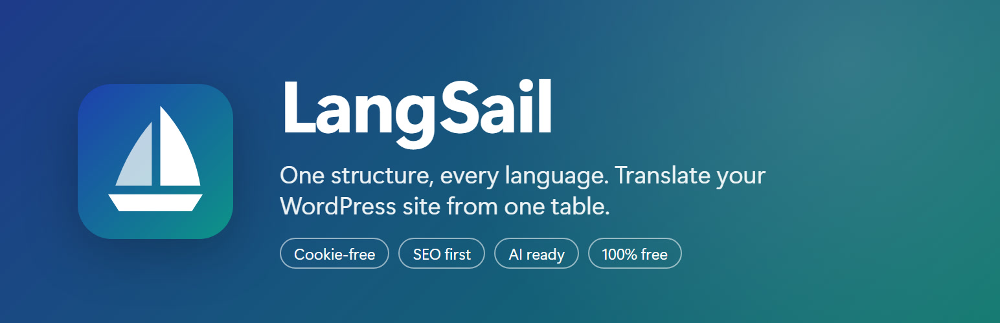
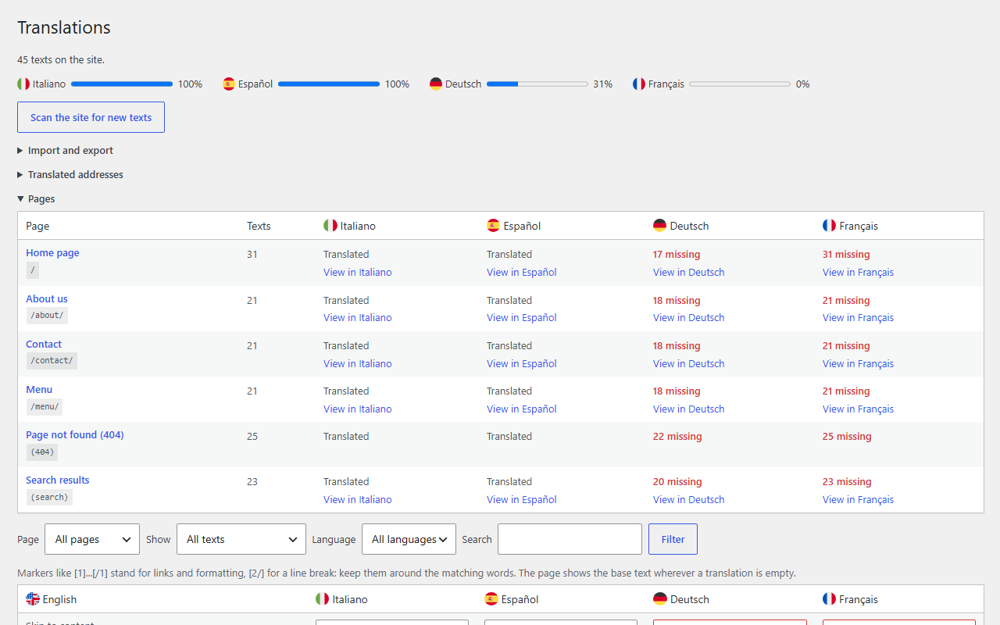
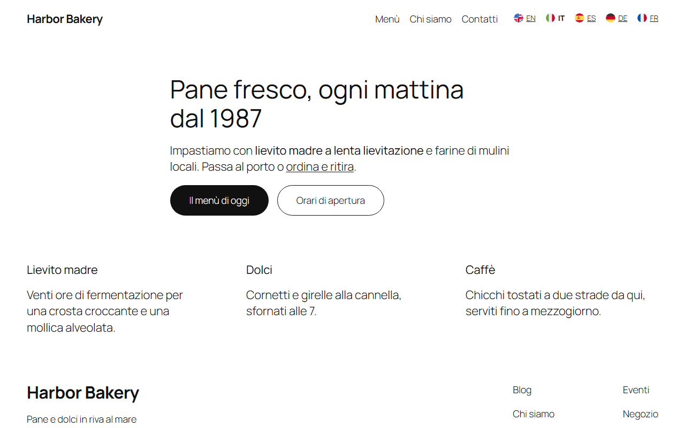
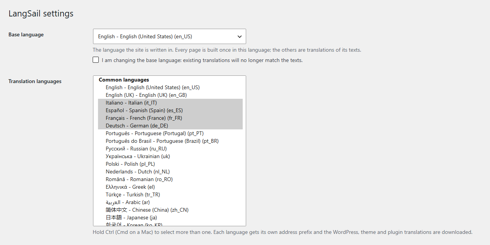

<p align="center">
  
</p>

<p align="center">
  <br>
  <strong>LangSail</strong><br>
  Multilingual WordPress with one structure: build every page once, translate its texts in a table.<br>
  No cookies, no JavaScript on the site, no external services.
</p>

<p align="center">
  
  
  
  
  
  
</p>

<p align="center">
  <a href="https://playground.wordpress.net/?blueprint-url=https://raw.githubusercontent.com/massimomazzariol/langsail/main/.wordpress-org/blueprints/blueprint-github.json"></a>
</p>

---

Most multilingual plugins copy every page once per language: change a layout and you change it four times. LangSail keeps **a single version** of every page, template and menu, written in the base language. Each other language is a translation of its texts, kept in a table. Change the layout once and every language follows.

Completely free: no paid tier, no account, no translation credits.

## Screenshots

| Translations | A page in Italian |
| --- | --- |
|  |  |

| Settings |
| --- |
|  |

## Features

- **Languages in the address.** The base language lives at `/`, the others at `/it/`, `/es/`, `/de/`... No cookies, no redirects by browser language, nothing stored in the visitor's browser.
- **Every text, one table.** A text unit is what a person reads as one piece: a paragraph with its links and bold words, a heading, a menu item, a button, an image description, a field placeholder, the page title and SEO description. LangSail finds them in the page as visitors see it, header, footer and other plugins' output included.
- **Pages overview.** Every page with the texts still missing in each language, one click to exactly those texts and to the page in that language. Filter by page, language, missing or to review.
- **Markup-safe.** Links and formatting appear as markers (`Hello [1]our team[/1]`), checked on save, so a translation cannot break the HTML.
- **Edits are not lost.** When a sentence changes, the old translation is carried over and marked *to review*. Untranslated texts fall back to the base language.
- **WordPress speaks the language.** On `/it/` the site runs in Italian: WordPress, theme and plugin strings, dates, `<html lang>`. Language packs are downloaded when you add a language.
- **SEO first.** `hreflang` alternates with `x-default`, localized canonical and internal links, translated titles, descriptions and JSON-LD, language versions in the sitemap. A language version is indexed only once its page is translated (threshold in the settings); until then it is sent with `noindex`.
- **Translated addresses (optional).** `/it/chi-siamo/` for `/about/`; links, switcher, hreflang and sitemap follow, and the original words keep working.
- **Language switcher block.** Native names or short codes, optional flags, every design tool of the block editor.
- **Import and export.** JSON with every text, language and address (local to live), PO per language for Poedit or a translator.
- **Translator role.** Translators get the table, imports and exports; settings stay with administrators.
- **Works with other plugins.** Fluent Forms messages and visitor emails, The SEO Framework sitemap, [Mintchat](https://github.com/massimomazzariol/mintchat) chat messages, and public filters for any plugin.

## How light is it

Measured on WordPress 7.1 with Twenty Twenty-Five and five languages:

| | Size |
| --- | --- |
| Frontend JavaScript | **0 bytes** |
| Cookies, local storage, external calls | **none** |
| Switcher stylesheet | 0.7 KB, inlined, only on pages with the switcher |
| Flags (optional) | about 0.7 KB per language, SVG |
| `hreflang` links | under 0.1 KB per language |
| Translating a page | about 8 ms for a 150 KB page, one cached dictionary query |
| Base language pages | untouched: no output buffering |
| Release ZIP | 182 KB, most of it the 201 optional flags |

## Your data

LangSail never changes your pages: they stay in the base language exactly as you built them. What it adds lives in the database under its own names, so any full database backup includes it.

| Data | Where |
| --- | --- |
| Settings | option `langsail_settings` |
| Translated address words | option `langsail_slugs` |
| Texts, the pages they appear on, translations | tables `{prefix}langsail_strings`, `{prefix}langsail_string_pages`, `{prefix}langsail_translations` |
| Translator role | role `langsail_translator`, capability `langsail_translate` |

| You... | What happens |
| --- | --- |
| Deactivate the plugin | Nothing is removed. The site shows the base language only; addresses like `/it/` answer "not found" until you activate it again. |
| Delete the plugin | **Nothing is removed by default**: install it again and everything is back. Only with **Settings > Your data > Delete all LangSail data** turned on are the tables, options and role erased. |
| Export (Translations > Import and export, or `wp langsail export`) | One JSON file with every text, translation, translated address and the settings. |
| Import that file | Restores it all, on the same site or another one (local to live). A site without languages yet also takes the settings. |

Removing LangSail for good from a site already indexed in several languages? Redirect the old language addresses (`/it/*`, `/es/*`...) to the base language pages, so search engines and visitors are not left on "not found".

## Usage

1. Activate the plugin and confirm the base language under **LangSail > Settings**.
2. Choose the translation languages (common ones are listed first).
3. Open **LangSail > Translations**, scan the site, translate.
4. Add the **Language switcher** block where visitors change language, usually the header.

New texts are collected by **Scan the site for new texts**, and automatically when you save in the block or site editor. To keep a brand name or code as it is, add it to **Never translate** or mark it in HTML with `translate="no"` or the `notranslate` class.

## AI agents

LangSail is AI ready without calling any AI itself. It registers its actions on the WordPress Abilities API, so the agent you connect can translate the site through the REST API (`/wp-json/wp-abilities/v1/`) or MCP with the official [WordPress MCP Adapter](https://github.com/WordPress/mcp-adapter). Write **Instructions for AI translators** in the settings (tone, audience, fixed terms): agents read them first, so every text sounds the same.

**Step by step, with the client configuration: [docs/ai-translation.md](docs/ai-translation.md).**

| Ability | What it does |
| --- | --- |
| `langsail/list-languages` | Your instructions for translators, the never-translate list, base and translation languages with their progress. Read-only. |
| `langsail/list-texts` | Texts of one language, filtered by missing, to review or all, by page and search, with paging. Read-only. |
| `langsail/save-translations` | Saves a batch of translations into one language. Translations with wrong markers are rejected and returned as errors. |
| `langsail/scan` | Visits every page to collect new and changed texts. |

All abilities need the `langsail_translate` capability (administrators and the Translator role) and run with that user's permissions. LangSail sends nothing anywhere: your agent reads the texts and writes the translations. Example prompt: *"Translate every missing text of the site into German, keep the markers, and save them as to review."*

## For developers

```php
// Translate a plain text in the current language (collected by scans).
$label = apply_filters( 'langsail_translate', $label );

// Translate a piece of HTML, unit by unit.
$html = apply_filters( 'langsail_translate_html', $html );

// Site languages, and a field per language in your own settings.
$languages = apply_filters( 'langsail_languages', array() );
$text      = apply_filters( 'langsail_get_translation', '', $source, $locale );
do_action( 'langsail_set_translation', $source, $locale, $translation );
```

The filter `langsail_skip_classes` adds classes whose elements are never translated. WP-CLI: `wp langsail scan`, `stats`, `export`, `import`, `cleanup`.

## Development

The integration test runs on any WordPress site with the plugin active:

```
wp eval-file path/to/langsail/tests/integration.php
```

In WordPress Studio, prefix the command with `studio`.

## License

GPL-2.0-or-later. Copyright 2026 Massimo Mazzariol, https://github.com/massimomazzariol/langsail. See [NOTICE](NOTICE): keep it, with the copyright notices, when you redistribute LangSail or a work based on it. Flags: [circle-flags](https://github.com/HatScripts/circle-flags), MIT.
